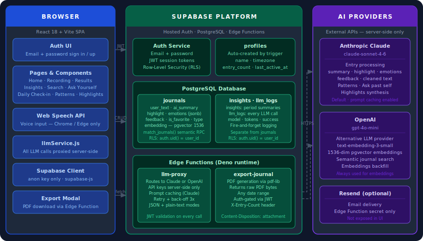

# MindScribe

**Your private voice journal, powered by AI.**

Speak or write what's on your mind. MindScribe turns it into a structured reflection: a clean summary, emotion tags, a highlight moment, and warm personal feedback. Everything stays private in your own Supabase database.

---

## What it does

1. **Record or write** — use your voice (Chrome/Edge) or type directly.
2. **AI structures it** — you get a summary, highlight, emotions, and feedback. Your own words are cleaned up with proper grammar but kept in your voice.
3. **Review and save** — edit any field, then save to your journal.
4. **Look back** — search entries, ask your past self questions, and see patterns over time.

---

## Features at a glance

| Feature | Description |
|---------|-------------|
| Auth | Email + password sign in / sign up. Each user sees only their own data. |
| Voice input | Record with the Web Speech API. Live transcript shown as you speak. |
| Text input | Write directly from the Add Entry modal. |
| AI processing | Produces `ai_summary`, `highlight`, `emotions`, `feedback`, and a grammar-cleaned version of your words — all via a secure server-side LLM proxy. |
| Smart search | Keyword search across summary, highlight, and emotions. Scored and ranked, max 20 results. |
| Ask your past self | Ask a natural-language question (e.g. "How was I feeling last month?"). AI answers using your actual journal entries. |
| Daily check-in | A quick mood tap at the top of the home screen, once per day. |
| Insights | Mood distribution charts across any date range. |
| Your Patterns | On-demand AI analysis of recurring emotional patterns from the last 7 days, written as an outside observer. |
| Highlights This Month | AI distills your best moments from the last 30 days into a short, warm paragraph addressed to you. |
| Export | Download a PDF of your entries for any date range, directly to your device. |
| Theme | Light / dark toggle, persisted across sessions. |
| Streak | 🔥 Daily journaling streak shown on the home screen. |

---

## Architecture



---

## Tech stack

| Layer | Choice |
|-------|--------|
| Frontend | React 18 + Vite |
| Styling | Tailwind CSS (class-based dark mode) |
| Auth + Database | Supabase (email/password auth, PostgreSQL, RLS) |
| LLM | OpenAI or Anthropic Claude — keys live **only** in Supabase Edge Function secrets, never in the browser |
| Speech | Web Speech API (Chrome / Edge only) |
| PDF export | `pdf-lib` inside a Supabase Edge Function |

---

## Getting started

### 1. Clone and install

```bash
git clone https://github.com/your-username/mindscribe.git
cd mindscribe
npm install
```

### 2. Create a `.env` file

```env
VITE_SUPABASE_URL=https://your-project.supabase.co
VITE_SUPABASE_ANON_KEY=your_anon_key
```

Only the **anon** key goes in the frontend. The `VITE_SUPABASE_*` variables are required — without them the Supabase client has nothing to connect to. LLM API keys are **not** stored here; they live in Supabase Edge Function secrets (step 3). Never commit `.env`.

### 3. Set up Supabase Edge Function secrets

Your LLM API keys live server-side only:

```bash
supabase secrets set LLM_PROVIDER=claude          # or: openai
supabase secrets set CLAUDE_API_KEY=sk-ant-...
supabase secrets set OPENAI_API_KEY=sk-proj-...   # required for embeddings even if using Claude
```

### 4. Run locally

```bash
npm run dev
```

Open [http://localhost:5173](http://localhost:5173) in **Chrome or Edge** (required for voice).

---

## Database setup

You need three tables in Supabase with RLS enabled:

- **`journals`** — `id`, `created_at`, `user_text`, `ai_summary`, `emotions` (jsonb), `feedback`, `highlight`, `type`, `is_favorite`, `embedding` (pgvector 1536, nullable)
- **`insights`** — period summary records saved from the Insights page
- **`llm_logs`** — one row per LLM call (tokens, model, success/failure)

All tables need a `user_id` column with:
- Default: `auth.uid()`
- RLS policy: `using (auth.uid() = user_id)`

A `profiles` table is also used, populated automatically by a trigger on `auth.users`.

---

## Project structure

```
src/
├── App.jsx                  # Auth gate + page router
├── main.jsx                 # Root: ThemeProvider > AuthProvider > JournalProvider
├── context/
│   ├── AuthContext.jsx      # Session management
│   ├── JournalContext.jsx   # Entry state + Supabase helpers
│   └── ThemeContext.jsx     # Light/dark theme
├── pages/
│   ├── AuthPage.jsx         # Login / sign up
│   ├── Home.jsx             # Feed, search, Ask, check-in
│   ├── Recording.jsx        # Voice recording
│   ├── Results.jsx          # Review + edit + save entry
│   └── WeeklyInsights.jsx   # Stats, patterns, highlights
├── components/              # Reusable UI (modals, cards, buttons)
├── services/
│   ├── supabaseClient.js
│   ├── supabaseService.js   # DB CRUD
│   └── llmService.js        # All LLM calls (via proxy)
├── hooks/                   # useDebounce, useSpeechRecognition
└── utils/                   # helpers (emotions, dates, streak)

supabase/functions/
├── llm-proxy/               # Routes LLM calls (Claude/OpenAI), keeps keys server-side
└── export-journal/          # Generates and returns journal PDF
```

---

## Deploying Edge Functions

```bash
supabase functions deploy llm-proxy --no-verify-jwt
supabase functions deploy export-journal --no-verify-jwt
```

---

## Notes

- Voice recording requires **Chrome or Edge**. Firefox does not support the Web Speech API.
- LLM responses are reflective and personal — not clinical or diagnostic.
- The app is designed for personal use. All data is scoped to the logged-in user via Supabase RLS.
